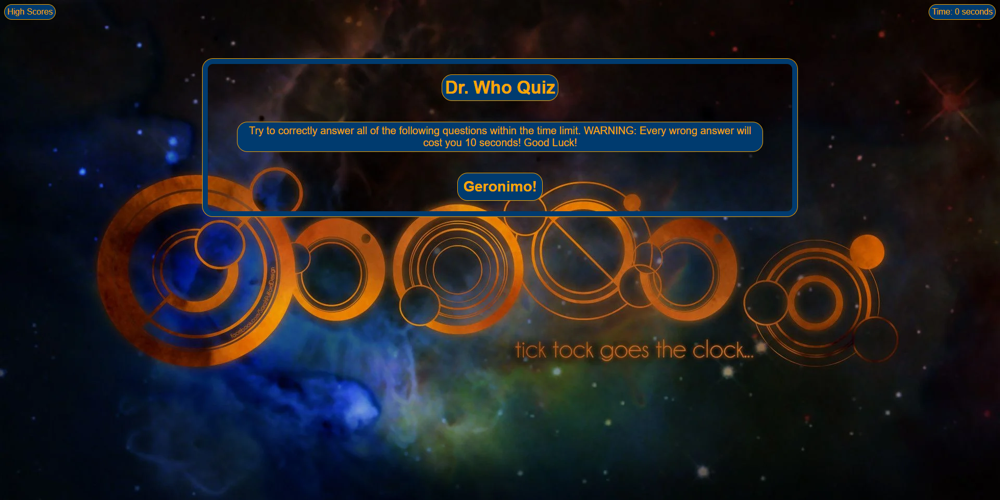

# Dr. Who - Quiz
Georgia Tech Coding Bootcamp - Module 4 Challenge
 
## Description:
 
This project is a simple, single webpage quiz that I created using primarily JavaScript.

The motivation for this quiz comes from one of my all-time favorite television series- Dr. Who.

## What I Learned:
 
While working on this quiz I realized that while I thought I had a pretty good understanding of JavaScript, I had only just scratched the surface of it's capabilities. To accomplish the goals I wanted to achieve for this project, required many hours of research and sifting through resources.

## Link:

https://jplaisance41.github.io/DrWho-Quiz/

## Screenshot

